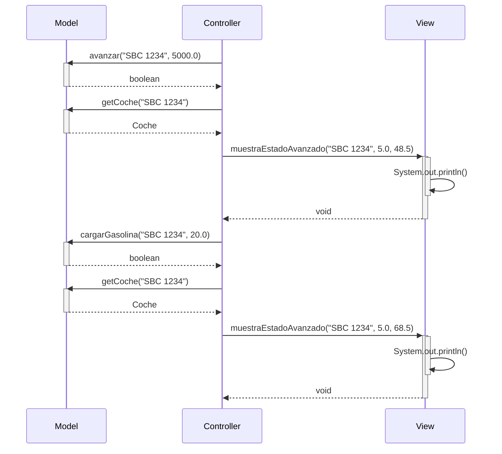

Diagrama de secuencia de mi codigo actualizado:

```mermaid
sequenceDiagram
    participant Model
    participant Controller
    participant View
    Controller->>Model: avanzar("SBC 1234", 5000.0)
    activate Model
    Model-->>Controller: boolean
    deactivate Model
    Controller->>Model: getCoche("SBC 1234")
    activate Model
    Model-->>Controller: Coche
    deactivate Model
    Controller->>+View: muestraEstadoAvanzado("SBC 1234", 5.0, 48.5)
    activate View
    View->>-View: System.out.println()
    View-->>Controller: void
    deactivate View
    Controller->>Model: cargarGasolina("SBC 1234", 20.0)
    activate Model
    Model-->>Controller: boolean
    deactivate Model
    Controller->>Model: getCoche("SBC 1234")
    activate Model
    Model-->>Controller: Coche
    deactivate Model
    Controller->>+View: muestraEstadoAvanzado("SBC 1234", 5.0, 68.5)
    activate View
    View->>-View: System.out.println()
    View-->>Controller: void
    deactivate View
```